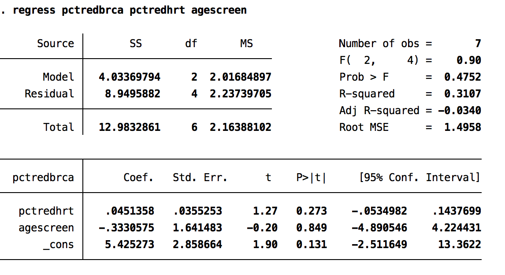
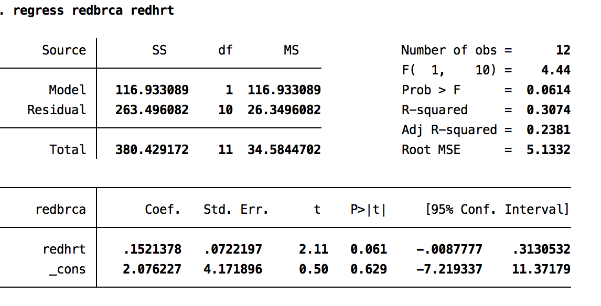

Title: AnnBrCaPaper
Author: Arindam Bose
Base Header Level: 1

## The Work so Far (Preliminary Analyses)

Data from the spreadsheet was abstracted and a new data table was created that contained the following information:

1. The name of the country where the screening for breast cancer, 
2. The percentage reduction in the usage of HRT between peak use and the last reported use
3. The percentage reduction in the reported incidence for the corresponding years for the relevant age groups (50-64+)
4. The Age Range at which Screening for Breast Cancer using Mammograms begin.  If the age range was 50-64 years, it was given a code of 1, else if the age at which mammogram began was earlier (that is for younger age), the Age range variable was assigned a code of 2.

In addition to this, data from the papers by Verkooijen et al 
\cite(Verkooijen, Bouchardy, Vinh-Hung, Rapiti, & Hartman, 2009) and Zbuk et al \cite(Zbuk & Anand, 2012) were extracted. For each of these data, the following information were abstracted from each paper

1. The name of the country where the study was conducted
2. The percentage of reduction from peak HRT usage till the date when it was reported
3. The reduction in percentage in the corresponding breast cancer incidence as reported in the paper. 

These were presented in a corresponding table abstracted from the papers (see Figures 1 and 2). For each of the three data, a linear regression model was run to study the extent to which reduction in the HRT usage might explain the reduction in the incidence of Breast Cancer. For the current dataset, in addition, the relationship between the reduction in Breast Cancer and the HRT usage was further adjusted for by including the age at which screening begins. 

## Results

Table 1 shows the data abstracted from the current dataset.

| Country   | Reduction in HRT Usage (pct) | Reduction in Br Ca (percent) |  Age Category of Screening |
|---------- | ---------------------------- | -------------------------    | ---------------------------| 
| Australia | 43                           | 6.7                          | 40-75                      |             
| Canada    | 70                           | 8                            | 50-69                      | 
| Denmark   | 19                           | 5.63                         | 50-69                      |
| France    | 66                           | 6.3                          | 50-69                      |
| Italy     | 42                           | 6.18                         | 50-69                      |
| United States |  33                       |6.7                           | 40-75                      |
| Germany   | 50                           |8.8                           | 40-75  |
| Belgium   |60  |9.5  |50-69 | 
 

Figure 1 shows the graph from the regression model of the relationship between reduction in HRT usage and reduction in breast cancer incidence from the studies included in this paper

Exhibit 1 shows the results of the regression model from the data abstracted for this analysis.

## Comparison with Two Other Studies (Zbuk and Anand and Verkooijen et al)

For comparison, we present two other datasets and two other analyses, one from the paper by Zbuk and Anand and the other by a paper by Verkooijen. 

Figure 2. Data from the paper by Zbuk

Figure 3 presents the results of data analyses and regression model constructed from the zbuk data. 

Figure 4 presents the regression outputs from the Zbuk data abstracted from the paper

Figure 5 presents the tables from Verkooijen study

Figure 6 presents the figure of the data analyses from regression model constructed from Verkooijen study

Figure 7 presents the figure of the regression table from Verkooijen study

## Reference

Verkooijen, H. M., Bouchardy, C., Vinh-Hung, V., Rapiti, E., & Hartman, M. (2009). The incidence of breast cancer and changes in the use of hormone replacement therapy: A review of the evidence. Maturitas, 64(2), 80-5. doi:10.1016/j.maturitas.2009.07.015
Zbuk, K., & Anand, S. S. (2012). Declining incidence of breast cancer after decreased use of hormone-replacement therapy: Magnitude and time lags in different countries. Journal of Epidemiology and Community Health, 66(1), 1-7. doi:10.1136/jech.2008.083774

